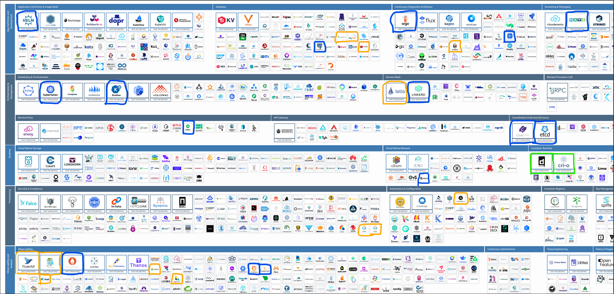

# CNCF Cloud Native Landscape

This image highlights the tools and technologies I have used directly, indirectly, or outside of the course context. Below is a list of these tools categorized by their type of usage and how they were utilized.

---

## Tools Used

### Directly Used Tools (Blue Circle)
| Tool           | Description                                                 | Usage Context              |
|----------------|-------------------------------------------------------------|----------------------------|
| **Helm**       | Kubernetes package manager.                                 | Installed Prometheus, Grafana, etc. |
| **Kubernetes** | Container orchestration platform.                           | Managing containerized applications. |
| **Knative**    | Serverless framework on Kubernetes.                         | Implemented serverless features. |
| **PostgreSQL** | Relational database system.                                 | Used as database for apps.  |
| **ArgoCD**     | GitOps continuous delivery tool for Kubernetes.             | Managed Kubernetes resources. |
| **GitHub Actions** | CI/CD pipeline automation.                              | Automated testing and deployment. |
| **NATS** | Messaging system for distributed systems.               | Handled message queue for microservices. |
| **Linkerd**    | Service mesh for Kubernetes.                                | Managed service-to-service communication. |
| **CoreDNS**    | DNS server for Kubernetes clusters.                         | Provided DNS for Kubernetes. |
| **etcd**       | Key-value store for Kubernetes cluster configuration.       | Kubernetes cluster configuration storage. |
| **Nginx**      | Web server and reverse proxy for web traffic.               | Handled load balancing and traffic. |
| **Calico**     | Networking and network security solution for containers.    | Managed network policies in Kubernetes. |
| **Prometheus** | Monitoring and alerting toolkit.                            | Monitored Kubernetes resources. |
| **Grafana**    | Visualization and analytics platform.                       | Visualized metrics from Prometheus. |
| **Loki**       | Log aggregation system.                                     | Collected and queried logs from Backend. |

### Indirectly Used Tools (Green Circle)
| Tool           | Description                                                 | Usage Context              |
|----------------|-------------------------------------------------------------|----------------------------|
| **containerd** | High-level container runtime for Kubernetes.                | Used as container runtime. |
| **CRI-O**      | Lightweight container runtime for Kubernetes.               | Facilitated container orchestration. |

### Outside Course Context (Orange Circle)
| Tool           | Description                                                 | Usage Context              |
|----------------|-------------------------------------------------------------|----------------------------|
| **MongoDB**    | NoSQL database.                                             | Used in web applications.  |
| **MySQL**      | Relational database.                                        | Used for application databases. |
| **Redis**      | In-memory key-value data store.                             | Used for caching and message brokering. |
| **Jenkins**    | Automation server for CI/CD pipelines.                      | Implemented CI/CD pipelines for projects. |
| **Istio**      | Service mesh for microservices.                             | Managed traffic between microservices. |
| **Ansible**    | Configuration management tool.                              | Automated infrastructure provisioning. |
| **Trivy**      | Vulnerability scanner for containers.                       | Scanned container images for vulnerabilities. |
| **Fluentd**    | Log collector and aggregator.                               | Collected logs from microservices. |
| **Jaeger**     | Distributed tracing system.                                 | Traced requests across microservices. |
| **Kiali**      | Service mesh observability tool.                            | Observed and visualized service mesh (Istio). |
| **Logstash**   | Data collection engine for Elasticsearch.                   | Ingested logs into Elasticsearch. |
| **Elasticsearch** | Search and analytics engine.                             | Used for log indexing and search. |

---

## Notes
- The tools circled in **blue** were directly used during various projects, most notably in Kubernetes-based environments.
- The tools circled in **green** were indirectly used, meaning they were dependencies or underlying components in the direct usage of other tools.
- The tools circled in **orange** were used in other contexts outside of the main course, typically in personal or professional projects.
